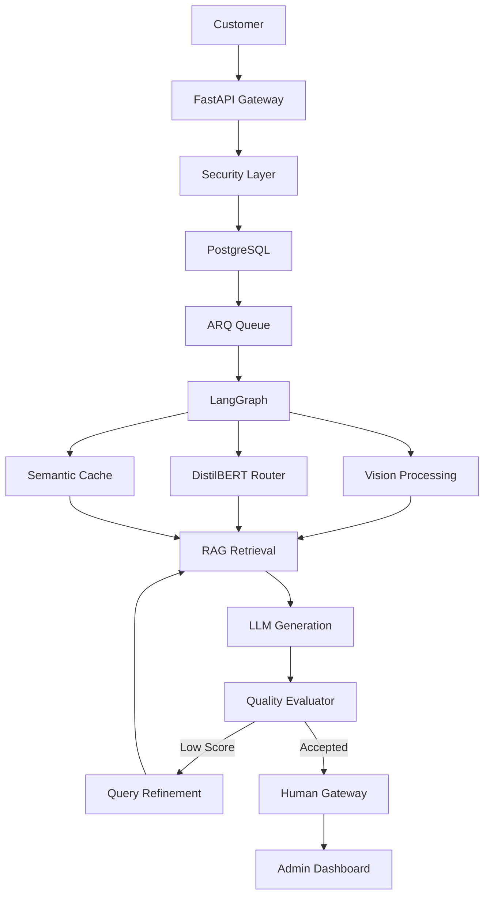
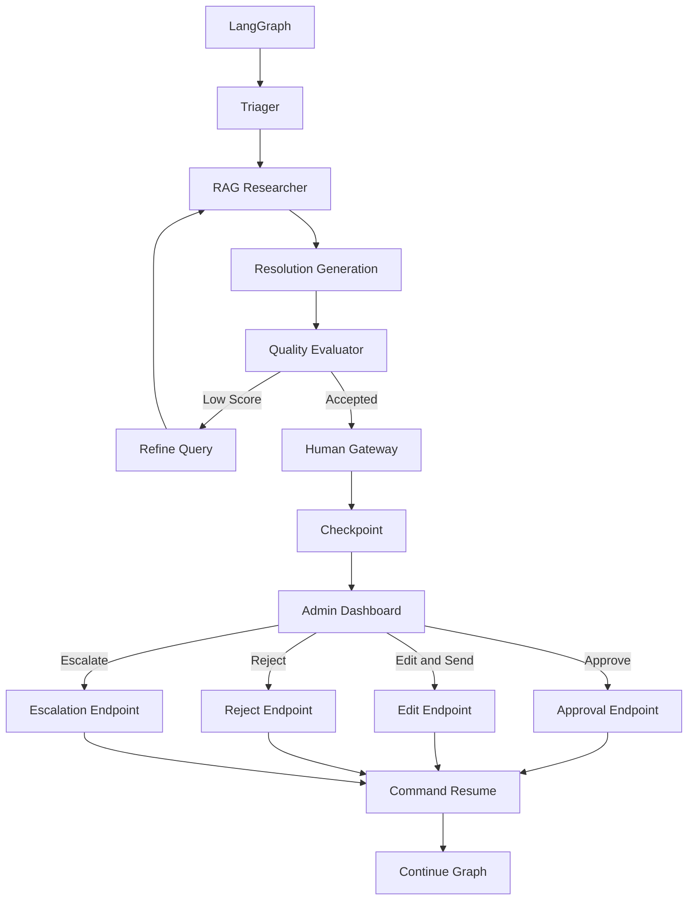
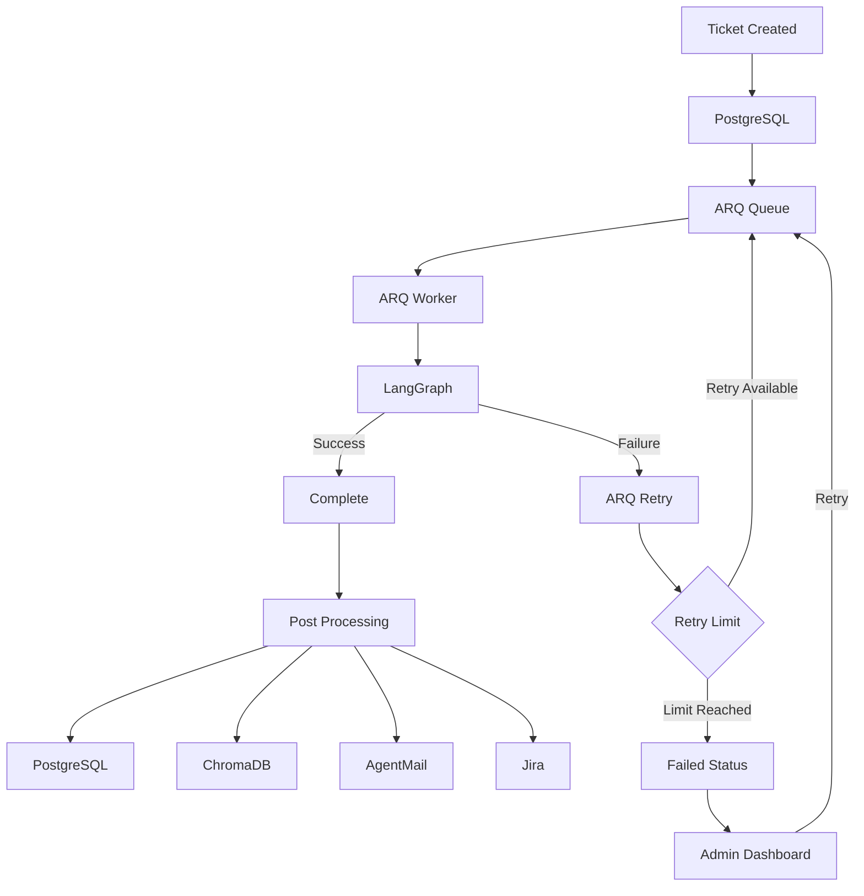

# AI Incident Response & Customer Support Platform

An asynchronous, AI-powered incident-response platform designed to automate the lifecycle of enterprise support tickets while keeping humans in control of high-risk or uncertain decisions.

The system combines multimodal ticket processing, fine-tuned transformer-based classification, hybrid RAG, stateful LangGraph orchestration, runtime evaluation, human-in-the-loop approval, asynchronous job processing, semantic memory, engineering escalation, and production observability.

The goal is not to build another chatbot.

The goal is to build a system that can take a ticket from:

**Customer submission → triage → research → evaluation → human decision → resolution/escalation → persistent learning**

while keeping PostgreSQL as the source of truth throughout the lifecycle.

---

## Diagram 1: System Overview



## Diagram 2:  LangGraph + HITL



## Diagram 3: ARQ + Persistence



---

# 1. User Account & Authentication

The workflow begins with the customer-facing application.

A customer creates an account and authenticates into the platform.

Authentication protects customer resources and ensures that a customer can only interact with their own tickets.

The frontend communicates with the FastAPI backend using authenticated API requests.

The customer can then:

* Create a support ticket
* Provide a subject
* Describe the problem
* Upload an optional screenshot
* View ticket status
* View the eventual resolution
* Submit feedback

The frontend is implemented using Next.js/React, while FastAPI provides the backend API layer.

---

# 2. Ticket Creation

When a customer submits a ticket, the request reaches:

```text
POST /tickets
```

The request contains:

```text
subject
body
optional image
authenticated customer
```

The most important architectural decision happens here:

## The ticket is persisted before AI processing begins.

The ticket is immediately written to PostgreSQL with a lifecycle status such as:

```text
QUEUED
```

This makes PostgreSQL the **source of truth** for the ticket lifecycle.

The system does not rely on Redis, LangGraph memory, or an LLM response as the authoritative representation of the ticket.

PostgreSQL knows:

```text
Who created it
What was submitted
When it was created
Current status
Thread ID
AI processing state
Final resolution
Human decision
Engineering resolution
```

This also means that if the AI pipeline crashes immediately after submission, the ticket still exists.

The platform has not lost the customer's request.

---

# 3. Input Sanitization

Before AI processing, the ticket passes through the security boundary.

Microsoft Presidio is used to identify and anonymize sensitive information such as:

```text
Email addresses
Phone numbers
IP addresses
API keys
Secrets
Credit-card-like values
```

Sensitive values are replaced with safe placeholders before AI processing and vector-memory operations.

This prevents sensitive information from unnecessarily propagating into:

```text
LLM prompts
Vector databases
Logs
AI-generated context
```

---

# 4. Why the Database Comes First

The architecture deliberately follows:

```text
REQUEST
   ↓
VALIDATE
   ↓
PERSIST
   ↓
PROCESS
```

rather than:

```text
REQUEST
   ↓
AI
   ↓
TRY TO SAVE RESULT
```

This distinction is important in production.

If the AI service fails:

```text
Ticket still exists.
```

If Redis goes down:

```text
Ticket still exists.
```

If a worker crashes:

```text
Ticket still exists.
```

If LangGraph fails:

```text
Ticket still exists.
```

The system can therefore recover processing later without losing the original business event.

---

# 5. Semantic Cache

After the ticket is persisted, the system checks whether a semantically similar resolved ticket already exists.

The ticket is embedded and compared against previous resolved cases stored in the semantic cache.

Conceptually:

```text
New Ticket
     ↓
Embedding
     ↓
Semantic Search
     ↓
Similar Resolved Ticket?
```

If a sufficiently similar resolution is found:

```text
Cache Hit
     ↓
Reuse Resolution
     ↓
Update PostgreSQL
     ↓
Return Result
```

This avoids unnecessarily invoking the complete AI pipeline for repetitive incidents.

The cache therefore provides two benefits:

### Latency

Repeated issues can be answered much faster.

### Cost

The system avoids unnecessary model inference, retrieval, and generation.

The current implementation uses ChromaDB-based semantic matching for this purpose.

The similarity threshold should be treated as an important production parameter because a cache hit bypasses downstream AI reasoning and human review.

---

# 6. ARQ — Asynchronous Job Processing

If no suitable cached resolution exists, the ticket is submitted to the ARQ job queue backed by Redis.

```text
PostgreSQL
     ↓
ARQ
     ↓
Redis
     ↓
Worker
```

This is important because AI processing is not a good fit for a normal synchronous HTTP request.

The customer should not have to keep:

```text
POST /tickets
```

open while the system performs:

* Vision inference
* Classification
* LLM calls
* Vector searches
* Reranking
* Evaluation
* Retry loops
* Human interruption

Instead:

```text
Customer
   ↓
Create ticket
   ↓
PostgreSQL
   ↓
Queue job
   ↓
Return ticket immediately
```

The customer can continue using the application while the worker processes the ticket asynchronously.

---

# 7. Why ARQ Instead of FastAPI BackgroundTasks?

This distinction is important.

## FastAPI BackgroundTasks

Useful for short tasks that can happen after an HTTP response.

For example:

```text
Update a secondary record
Send a lightweight notification
Perform a small post-processing operation
```

But it is not intended to be your durable job queue.

If the application process disappears, an in-process background task can disappear with it.

---

## ARQ

ARQ provides a dedicated worker and Redis-backed job queue.

Your architecture uses ARQ for the actual long-running AI workflow.

```text
FastAPI
   ↓
Redis Queue
   ↓
ARQ Worker
   ↓
LangGraph
```

This separates:

```text
HTTP request handling
```

from:

```text
AI computation
```

The worker can also recover queued/unfinished work after startup. Your implementation explicitly checks for unfinished `QUEUED` tickets and requeues them.

### Important production principle

ARQ does not magically provide exactly-once processing.

A production system should assume a job can potentially execute more than once.

Therefore operations such as:

```text
Send email
Create Jira ticket
Update resolution
```

should be designed to be **idempotent**.

For example:

```text
ticket_id = 42
delivery_status = SENT
```

Before sending another email, check whether the operation has already succeeded.

This prevents:

```text
Worker crash
   ↓
Job retries
   ↓
Customer receives two emails
```

---

# 8. LangGraph Starts

Once the ARQ worker picks up the job, LangGraph becomes responsible for the actual AI workflow.

The worker reconstructs the graph and its persistence layer before executing the ticket workflow.

The ticket enters the graph with state containing information such as:

```text
ticket_id
thread_id
customer information
ticket text
image information
department
confidence
retry count
retrieval results
evaluation results
```

The graph provides the system with explicit state transitions rather than a collection of disconnected LLM calls.

---

# 9. Multimodal Processing

If the customer attached a screenshot, the system sends it through the Qwen vision model.

The vision model extracts useful information such as:

```text
Error messages
Stack traces
Visible configuration
UI errors
Error codes
Relevant diagnostic information
```

The result is combined with the customer's written description.

The system therefore creates a unified representation:

```text
Customer Text
      +
Image-derived Context
      ↓
Unified Ticket
```

This is important because customers often describe an incident incompletely.

The screenshot may contain the information required to correctly understand the problem.

---

# 10. Department Classification

The unified ticket is then passed to the local fine-tuned transformer classifier.

The classifier determines:

```text
Department
Confidence
```

The model was adapted to become familiar with the platform's specific department taxonomy rather than relying purely on a generic pretrained representation.

This gives the system a fast local routing layer.

For example:

```text
Ticket
 ↓
Fine-tuned classifier
 ↓
Infrastructure
 ↓
Confidence: 0.94
```

The system can also use the classification to determine whether additional runtime telemetry is relevant.

---

# 11. AI Triager

The ticket then reaches the LLM-based triager.

The triager considers the available context and produces structured information such as:

```text
Search query
Priority
Tags
Keywords
```

It can use:

```text
Ticket
Department
Customer/account context
Image-derived information
Telemetry
Previous evaluator feedback
```

The purpose of this node is not simply to answer the customer.

Its job is to determine:

> "What should I search for, and what information do I need to resolve this incident?"

---

# 12. Hybrid RAG

The retrieval layer searches the internal knowledge base.

Rather than depending on a single retrieval technique, the system combines:

```text
Dense semantic search
+
BM25 keyword search
+
Reciprocal Rank Fusion
+
Cross-encoder reranking
```

This gives the system both:

### Semantic understanding

Useful when the ticket and documentation use different wording.

### Keyword precision

Useful for:

```text
Error codes
Port numbers
Function names
Configuration keys
Specific technical terminology
```

The retrieved documents are then reranked so that the strongest evidence reaches the generation/evaluation stages.

Tenant filtering is also enforced during retrieval so one customer's knowledge cannot leak into another customer's retrieval context.

---

# 13. Token-Aware Context Management

During document ingestion, chunks are measured using tokens rather than simply splitting based on character length.

This is important because LLM context windows are token-based.

Using token-aware chunking helps control:

```text
Context size
Retrieval payload
LLM cost
Latency
Context-window pressure
```

It also makes it easier to enforce a predictable context budget when constructing prompts.

---

# 14. Response Generation

Once relevant evidence has been retrieved, the system generates a proposed resolution.

The generated response is structured around things such as:

```text
Greeting
Issue summary
Root cause
Resolution steps
Closing
Complete response
```

But the system does **not** blindly trust the generated response.

That is where Node 3 becomes important.

---

# 15. Runtime RAG Evaluation

The evaluator acts as a quality gate.

It evaluates the proposed resolution using three important RAG dimensions:

### Faithfulness

> Is the response actually supported by the retrieved documents?

### Answer Relevancy

> Does the response actually answer the customer's issue?

### Context Precision

> Did the retrieval system provide useful evidence rather than noisy or irrelevant documents?

It also produces information such as:

```text
Confidence
Hallucination indication
Supporting sources
Rewrite feedback
```

The graph then makes a decision.

```text
Score >= 0.70
       ↓
Continue
```

or:

```text
Score < 0.70
       ↓
Refine search
       ↓
Retry
```

The graph can repeat this process up to the configured retry limit.

---

# 16. Why the Retry Loop Exists

The retry loop is one of the strongest parts of the architecture.

A failed retrieval does not immediately mean:

> "AI cannot solve this."

Instead:

```text
Poor result
   ↓
Evaluator identifies problem
   ↓
Feedback
   ↓
Query refinement
   ↓
New retrieval
   ↓
New evaluation
```

This gives the system a controlled form of agentic behavior.

The graph therefore behaves more like:

```text
Research
   ↓
Evaluate
   ↓
Research better
   ↓
Evaluate again
```

rather than:

```text
Ask LLM once
   ↓
Hope it is correct
```

Your implementation currently allows up to three unsuccessful attempts before escalation.

---

# 17. Human-in-the-Loop

Once the system has a sufficiently strong result, it does not automatically send the response.

Instead, LangGraph reaches the human gateway.

The graph calls:

```python
interrupt()
```

and pauses.

The state is checkpointed using PostgreSQL.

This creates:

```text
AI
 ↓
Human
```

rather than:

```text
AI
 ↓
Customer
```

for the approval-controlled path.

The administrator can see:

* Original ticket
* Customer information
* Department
* Confidence
* Retrieved evidence
* AI-generated response
* Evaluation results
* Retry history
* Relevant telemetry

The administrator then has several actions.

---

# 18. Admin Approval Controls

The admin dashboard provides actions such as:

```text
APPROVE & SEND
```

```text
EDIT & SEND
```

```text
REJECT & ESCALATE
```

### Approve & Send

The administrator accepts the AI-generated resolution.

```text
Admin
 ↓
Approve
 ↓
Resume LangGraph
 ↓
AgentMail
 ↓
Customer
```

### Edit & Send

The administrator modifies the AI response before sending it.

```text
AI Draft
 ↓
Human Edit
 ↓
Final Response
 ↓
AgentMail
```

The system records the distinction between:

```text
AI-generated response
```

and:

```text
Human-approved final response
```

This becomes valuable feedback.

### Reject & Escalate

If the administrator does not trust the response:

```text
Reject
 ↓
Jira
 ↓
Engineering
```

The ticket becomes part of the engineering escalation workflow.

---

# 19. Resuming LangGraph

The approval endpoint receives the administrator's decision.

The important identifier is:

```text
thread_id
```

The ticket's `thread_id` identifies the paused LangGraph execution.

The approval endpoint can retrieve the graph state using:

```python
graph.aget_state(...)
```

and resume the interrupted execution using the appropriate LangGraph command:

```python
Command(resume=...)
```

The graph therefore does not start from the beginning.

It continues from the persisted checkpoint.

This is one of the strongest architectural characteristics of the project:

```text
Ticket
   ↓
LangGraph
   ↓
Pause
   ↓
PostgreSQL checkpoint
   ↓
Hours later
   ↓
Admin decision
   ↓
Command(resume=...)
   ↓
Continue from checkpoint
```

The API and worker can therefore be restarted without losing the paused workflow.

Your implementation uses PostgreSQL-backed LangGraph persistence and the ticket thread ID to support this continuation model.

---

# 20. AsyncPostgresSaver

The LangGraph checkpointer uses:

```text
AsyncPostgresSaver
```

This allows LangGraph state to be persisted asynchronously into PostgreSQL.

There are therefore two related types of persistence:

### Business persistence

PostgreSQL stores the ticket itself:

```text
ticket
customer
status
resolution
evaluation
escalation
feedback
```

### Workflow persistence

PostgreSQL also stores the LangGraph checkpoint:

```text
thread_id
graph state
current execution position
interrupt state
```

These serve different purposes.

The ticket database answers:

> "What happened to this ticket?"

The LangGraph checkpoint answers:

> "Where did this workflow stop, and what state does it need to resume from?"

---

# 21. After Approval

Once the graph resumes, the system moves into the finalization stage.

The system:

```text
Selects final response
        ↓
Updates ticket
        ↓
Persists resolution
        ↓
Sends customer response
        ↓
Records delivery
```

AgentMail is used for customer-facing email delivery.

The system also records information about the delivery and final ticket state in PostgreSQL.

---

# 22. Human-vs-AI Semantic Diff

If an administrator edits the AI response, the platform compares:

```text
AI Draft
   vs
Human Final Response
```

The semantic-diff process attempts to identify meaningful differences.

For example:

```text
AI:
Restart the service on port 8080.

Human:
Restart the service on port 8443.
```

The system can identify that the human correction contains a factual change.

This allows the platform to capture useful human knowledge rather than simply throwing the edited response away.

---

# 23. Resolved Ticket Memory

The final resolved ticket is then converted into a reusable semantic memory.

Importantly, resolved tickets are stored in a **separate collection from the primary knowledge base**.

This avoids mixing:

```text
Official documentation
```

with:

```text
Historical resolutions
```

That separation matters because historical tickets may contain outdated or case-specific information.

The system can therefore distinguish between:

```text
Knowledge Base
```

and:

```text
Resolved Incident Memory
```

while still allowing future retrieval to benefit from historical resolutions.

---

# 24. Engineering Escalation

When the AI cannot confidently resolve an incident, it should not continue guessing.

After repeated unsuccessful evaluation attempts, the ticket is escalated.

The Jira payload can contain:

```text
Subject
Original ticket
Department
Confidence
Account information
Search query
Keywords
Retrieved documents
Image/OCR context
Telemetry
```

Jira becomes the bridge between the AI support system and the engineering organization.

---

# 25. Engineer Resolution Workflow

The platform also provides an engineering resolution interface.

An engineer can open an escalated ticket and provide:

```text
Engineer ID
Root cause
Troubleshooting steps
Final solution
```

The engineering resolution becomes part of the ticket's permanent lifecycle.

This closes the loop:

```text
Customer
   ↓
AI
   ↓
Human Support
   ↓
Engineering
   ↓
Engineer Resolution
   ↓
Future Knowledge
```

Your database model already accounts for engineer resolutions and ticket differences.

---

# 26. Retry Failed Tickets

The administrator can also retry tickets that fail during processing.

For example:

```text
Ticket
 ↓
ARQ
 ↓
Worker
 ↓
Failure
 ↓
Status = FAILED
```

The admin can click:

```text
Retry
```

The backend can then enqueue the ticket again into ARQ.

```text
FAILED
  ↓
RETRY
  ↓
Redis
  ↓
ARQ
  ↓
Worker
  ↓
LangGraph
```

This is preferable to requiring an engineer to manually recreate the ticket.

The original PostgreSQL ticket remains the source of truth while the processing job is recreated.

---

# 27. Database as the Permanent Record

PostgreSQL stores the complete ticket lifecycle.

The ticket can contain information such as:

```text
Original subject
Original body
Image information
OCR context
Department
Confidence
Priority
Tags
Search query
Retrieved documents
Evaluation results
Retry count
AI draft
Human decision
Final response
Email delivery information
Latency
Feedback
Engineer resolution
Jira escalation information
```

This makes PostgreSQL the historical record of what happened to each incident.

---

# 28. Frontend — Admin Control Room

The frontend is designed around the idea that the administrator should not have to manually inspect every ticket.

The dashboard should answer:

> "What happened while I was away, and what actually needs my attention?"

The admin experience can include:

### Overview Dashboard

```text
Tickets today
AI resolutions
Human reviews
Escalations
Failed jobs
SLA risks
Average confidence
Average resolution time
```

### AI Work Queue

Tickets requiring action:

```text
Needs approval
Low confidence
Failed
Escalated
SLA risk
```

### Ticket Detail

```text
Customer
Ticket
Image
Department
Confidence
AI reasoning/evidence
Retrieved sources
Evaluation
Draft response
Timeline
```

Actions:

```text
Approve & Send
Edit & Send
Reject & Escalate
Retry
```

### Users

Administrators can:

```text
View users
View user details
View account tier
View ticket history
View current/open incidents
```

### Engineering

Engineers can open escalated tickets and submit:

```text
Root cause
Investigation
Resolution steps
Final solution
```

### Drift Alerts

Administrators can see documentation drift detected by the system.

For example:

```text
API Documentation
   ↓
Repeated human corrections
   ↓
Semantic drift detected
   ↓
Alert
```

The platform can surface the affected document and the changes contributing to the alert.

Your existing admin API already exposes operational metrics and a latest drift alert endpoint, while the scheduler runs drift detection periodically.

---

# 29. Documentation Drift

The platform monitors whether humans are repeatedly correcting AI-generated answers in the same way.

For example:

```text
AI repeatedly says:
Use port 8080

Engineers repeatedly correct:
Use port 8443
```

That suggests the underlying documentation may be outdated.

Instead of only improving the AI prompt, the platform can tell the organization:

> "Your documentation may be wrong."

This turns the system into an operational intelligence tool rather than simply an automated support bot.

---

# 30. Observability

The system uses Langfuse to observe AI execution.

The objective is to understand:

```text
Which node ran?
How long did it take?
Which model was used?
How many tokens were consumed?
Where did the workflow fail?
How many retries occurred?
```

Prometheus is used for system-level metrics.

Examples include:

```text
LLM token usage
Node latency
Retry frequency
```

Offline evaluation can be handled with DeepEval/Ragas against a curated dataset.

The architecture therefore separates:

```text
Runtime Observability
```

from:

```text
Offline AI Evaluation
```

Your architecture already identifies Langfuse, Prometheus, and DeepEval/Ragas as the observability/evaluation layer.

---

# 31. The Complete Lifecycle

The entire system can therefore be summarized as:

```text
CUSTOMER
   │
   ▼
Create Account
   │
   ▼
Login
   │
   ▼
Submit Ticket
   │
   ▼
FASTAPI
   │
   ├── Authenticate
   ├── Validate
   ├── Sanitize PII
   │
   ▼
POSTGRESQL
   │
   └── Ticket = QUEUED
   │
   ▼
SEMANTIC CACHE
   │
   ├── HIT ───────────────► Reuse Resolution
   │
   └── MISS
          │
          ▼
        ARQ
          │
          ▼
        REDIS
          │
          ▼
      ARQ WORKER
          │
          ▼
      LANGGRAPH
          │
          ▼
      QWEN VISION
          │
          ▼
  UNIFIED TICKET
          │
          ▼
 FINE-TUNED CLASSIFIER
          │
          ▼
 DEPARTMENT + CONFIDENCE
          │
          ▼
     LLM TRIAGER
          │
          ▼
     HYBRID RAG
          │
          ▼
   GENERATE RESPONSE
          │
          ▼
      EVALUATOR
          │
      ┌───┴────┐
      │        │
    FAIL     PASS
      │        │
      ▼        ▼
   RETRY     HUMAN
      │        │
      │    ┌───┼───────────┐
      │    │   │           │
      │ Approve Edit    Reject
      │    │   │           │
      │    │   │           ▼
      │    │   │          JIRA
      │    │   │
      │    ▼   ▼
      │   FINAL RESPONSE
      │       │
      │       ▼
      │    AGENTMAIL
      │       │
      └───────┘
              │
              ▼
         POSTGRESQL
              │
              ▼
       SEMANTIC DIFF
              │
              ▼
       RESOLVED MEMORY
              │
              ▼
           CHROMADB
```

The result is a complete incident lifecycle rather than a single AI inference call.

---

# 32. Architectural Tradeoff: Global Graph Loop vs Local Agentic Retrieval

One of the important design decisions in this project was how to handle failed retrieval.

## Option A — Global LangGraph Loop

```text
Node 1
  ↓
Node 2
  ↓
Node 3
  ↓
FAIL
  ↓
Node 1
  ↓
Node 2
  ↓
Node 3
```

Advantages:

* Clear separation of responsibilities
* Easy state inspection
* Explicit retry behaviour
* Easy LangGraph tracing
* Each node has a defined responsibility

Disadvantages:

* Graph contains a cycle
* Retry execution is more visible in the overall graph

## Option B — Local Agentic Retrieval

```text
Node 1
  ↓
Node 2
   ├── Search
   ├── Evaluate
   ├── Rewrite
   ├── Search again
   └── Return result
  ↓
Node 3
```

Advantages:

* Simpler top-level graph
* Retrieval intelligence is encapsulated

Disadvantages:

* More responsibility inside Node 2
* More difficult to inspect from the main graph
* Internal reasoning requires additional logging
* Potentially harder to reason about retry behaviour

## Chosen Approach

For this project, the global LangGraph loop is the stronger architecture.

The graph explicitly represents:

```text
Research
 ↓
Evaluate
 ↓
Refine
 ↓
Research again
```

This improves observability and separation of concerns.

It also demonstrates an important AI engineering concept:

> **An agentic system does not need to be a collection of autonomous agents. It can be a controlled state machine where intelligence exists inside explicit, observable transitions.**

---

# 33. Why I Chose These Technologies

| Component              | Purpose                                       |
| ---------------------- | --------------------------------------------- |
| FastAPI                | API and ingestion layer                       |
| PostgreSQL             | Source of truth + workflow persistence        |
| Redis                  | Queue/cache infrastructure                    |
| ARQ                    | Durable asynchronous job execution            |
| LangGraph              | Stateful AI orchestration                     |
| Qwen Vision            | Multimodal image/OCR analysis                 |
| Fine-tuned Transformer | Fast department classification                |
| Llama                  | Triage, generation and evaluation             |
| ChromaDB               | Semantic retrieval and resolved-ticket memory |
| BM25                   | Keyword retrieval                             |
| RRF                    | Hybrid retrieval fusion                       |
| Cross Encoder          | Retrieval reranking                           |
| Presidio               | PII anonymization                             |
| AgentMail              | Customer response delivery                    |
| Jira                   | Engineering escalation                        |
| Langfuse               | LLM observability                             |
| Prometheus             | System metrics                                |
| DeepEval/Ragas         | Offline AI evaluation                         |
| Next.js/React          | Customer and admin interfaces                 |

---

# 34. Future Improvements

The architecture is intentionally extensible.

One future improvement is adding **tool calling**.

For example, the agent could eventually be given controlled tools such as:

```text
get_customer()
get_account_tier()
get_customer_history()
get_service_status()
get_database_health()
get_recent_incidents()
```

These tools could be backed by the existing APIs.

The important distinction is that the LLM should not receive unrestricted database access.

Instead:

```text
LLM
 ↓
Tool
 ↓
Validated API
 ↓
Authorized service
 ↓
Database
```

This provides a safer abstraction boundary.

Future tools could eventually allow the system to perform controlled diagnostic actions, such as checking service health or retrieving customer-specific operational information.

For destructive operations such as:

```text
database modifications
refunds
configuration changes
service restarts
```

the system should continue using strict authorization and human approval.

---

# 35. Other Future Improvements

Potential extensions include:

* Specialized departmental dashboards
* Direct routing to departmental endpoints
* Real production telemetry integrations
* More robust prompt-injection protection
* Automated incident clustering
* SLA prediction
* Better model routing
* Model cascading
* Cost-aware model selection
* Advanced tool calling
* More extensive load testing
* OpenTelemetry integration
* Automated deployment evaluation gates
* Larger golden datasets
* Automated documentation update workflows

The prompt-injection layer is also an area for future improvement. I previously experimented with Llama Guard, but it was removed from the active pipeline because the safety classifier was producing false positives for legitimate support tickets. The intended future direction is to reintroduce a properly calibrated prompt-injection defense after establishing a representative test set and tuning its decision policy.

---

# Final Architecture Philosophy

The most important idea behind this project is:

> **AI should not be the source of truth.**

The source of truth is the database.

AI is responsible for:

```text
Understanding
Classifying
Searching
Reasoning
Generating
Evaluating
Recommending
```

The system is responsible for:

```text
Persistence
Authorization
State
Retries
Human approval
Auditability
Delivery
Recovery
Observability
```

That distinction is what turns the project from an LLM demo into an AI engineering system.

---

# Project Lifecycle

```text
Customer submits problem
        ↓
System persists the event
        ↓
AI investigates
        ↓
System evaluates AI
        ↓
Human controls high-risk decisions
        ↓
System executes the approved action
        ↓
Everything is persisted
        ↓
Human corrections become useful memory
        ↓
Engineering receives unresolved problems
        ↓
Observability measures the entire system
```

That is the core of the platform.
